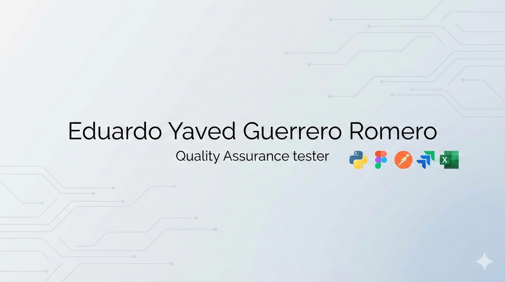

 

  

 
<h2>Sobre mi 😃</h2>
<!--Intro start-->

🎓 QUALITY ASSURANCE TESTER Certificado por Triple Tent

💻 La tecnología me apasiona y he decidido comenzar a trabajar dentro de la industria

📝 Me encuentro interesado por desarrollarme en la industria tech como QA tester ☺️

📫 Contacto: **eduardoy.guerreror@gmail.com*
<!--Intro end-->
  

 

<h2 >Tecnologías conocidas👨🏻‍💻</h2>
<!--tech stack icons-->

  

 
<!-------------------------->

<h2 >Algunos proyectos👨🏻‍💻</h2>

<table align="left" >
<tr border="none">
  <td width="25%" align="center">
    

     
      <h2>Atumatización de Pruebas</h2>
          
 
  • Trabaje en la automatización de pruebas de la página web "Urban Scooter" 
    empleando el POM para darle escalavilidad al proyecto y la reutilización
    del código, en caso de ser requerido.
            
  • Atumoatizé 9 pruebas mediante código en python, en las que se testearon 
  funcionalidades de la aplicación con las que el usuario tiene contacto directo.
  
  • Diseñé diagramas de flujo que documentan el comportamiento 
  esperado para entradas correctas e incorrectas.
  
  • Apliqué análisis de valores límite para identificar casos 
  críticos y escenarios de falla potencial.
  
  • Manejé elementos dinámicos que aparecen tras acciones 
  del usario.
  
  • Verifiqué flujos de navegación y ventanas emergentes 
  según especificaciones de UX/UI.
  
  • Documenté discrepancias entre requisitos y implementación 
  real de la aplicación.
          

      
      
</td>
<td width="25%" align="center">
    

     
       <h2>Pruebas Funcionales de Aplicaciones Web, Móvil y API</h2>
          
 
 • Diseñé mapra mental para vizualizar los requicitos de la aplicación web
  Urban scooter.
            
 • Diseñe casos de prueba para la página web urban scooter (usuarios), así mismo para 
 la aplicación móvil(repartidores) y las solicitudes API. Simulando la interacción, para
 probar la funcionalidad de las aplicaciones y la interacción con el servidor.
  
 • Realizé informes de errores mediante Jira. 
  
 • Diseñé casos de prueba positivos y negativos para 
  funcionalidad crítica del botón "Reservar"

  • Creé matriz completa de escenarios de testing cubriendo 
  flujos principales y casos excepcionales
            
  • Mantuve trazabilidad entre requisitos, diseños Figma 
  y casos de prueba ejecutados
          

      

</td>
  
  <td width="25%" align="center">
    

     
             <h2>Pruebas de aplicación web</h2>
          
 
• Derivé criterios de aceptación específicos a partir de 
  documentación técnica de requisitos del backend
            
• Identifiqué reglas de negocio, validaciones de datos y 
  comportamientos de error esperados para testing

  • Implementé cobertura completa de escenarios: casos positivos,
  negativos, casos límite y manejo de errores

  • Ejecuté casos de prueba utilizando Postman para validación 
  de endpoints de API en tiempo real

  • Creé reportes detallados de bugs identificados durante 
  testing de API utilizando Jira como herramienta de tracking
      

</tr>
</table>
  

 
  
 
   
  
